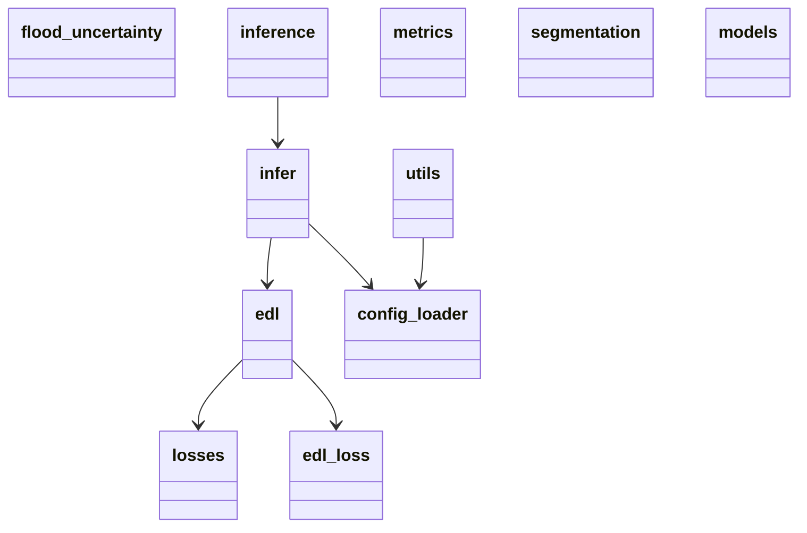
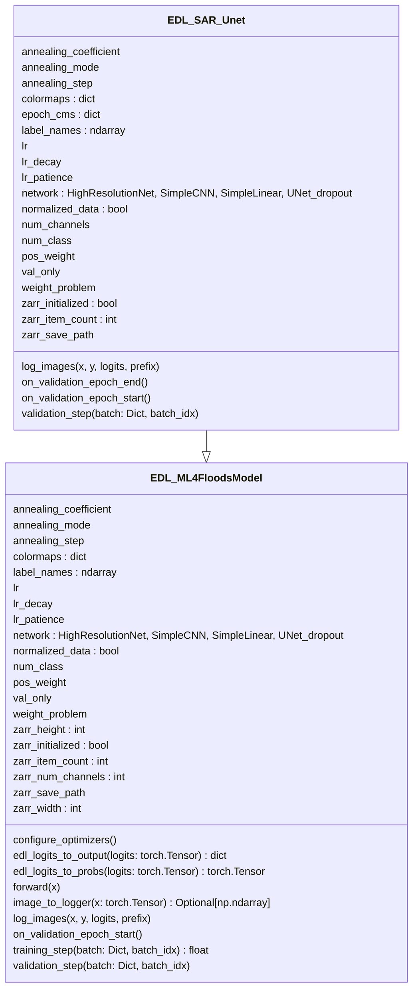

# 架構圖

> 本文件的 Mermaid 圖由 `pyreverse` 從程式碼靜態分析產生，**不要手動編輯標記區塊內的內容**。
> 程式碼變動後重新產生：
>
> ```bash
> bash scripts/dev/gen_diagrams.sh
> ```
>
> 圖與程式碼脫節時，以程式碼為準——重跑上面的指令即可。

---

## 1. 模組依賴

`flood_uncertainty/` 核心套件的模組間依賴。單向、無循環。

<!-- BEGIN PACKAGE_DIAGRAM -->



<!-- END PACKAGE_DIAGRAM -->

**讀圖重點**

- `config_loader` 扇入最高（被 `infer` 與多數 script 依賴），扇出最低（只依賴 `ml4floods`）——基礎設施模組該有的形狀。
- `metrics.segmentation` 在此圖中是孤立節點：核心套件內部不依賴它，只有 `scripts/eval` 與 `scripts/analysis` 會用。這是刻意的分層，評估不在訓練／推論的關鍵路徑上。
- 此圖看不到 `scripts/` 層。`flood_uncertainty` 尚未宣告為可安裝套件（`pyproject.toml` 缺 `[build-system]`），script 靠執行期 `sys.path.insert` 才能 import，靜態分析工具無法追蹤。

---

## 2. 類別結構

`flood_uncertainty/models/edl.py` 的類別圖。

<!-- BEGIN CLASS_DIAGRAM -->



<!-- END CLASS_DIAGRAM -->

**讀圖重點**

- `EDL_SAR_Unet` 重新宣告了幾乎全部父類屬性。正常繼承下子類應只列新增成員（此處實際新增的只有 `epoch_cms` 與 `num_channels`），屬性重複代表初始化邏輯是複製而非透過 `super().__init__()` 取得。
- `zarr_*` 六個屬性與 `_init_zarr_structure()` / `_append_batch_to_zarr()` 佔了模型類別相當比例。這是結果寫入器的職責被放進模型類別，可抽成獨立元件並以 Lightning callback 掛載，ensemble／MC dropout 亦可重用。
- `network` 的推斷型別是四個具體類別的聯集，代表 backbone 由 `ml4floods.configure_architecture()` 動態決定，沒有共同抽象介面。引入新 backbone（見 [`foundation_model_integration.md`](./foundation_model_integration.md)）時需先確立這層介面契約。

---

## 3. 相關文件

- [`BEF_integration_plan.md`](./BEF_integration_plan.md)：BEF 融合方法
- [`foundation_model_integration.md`](./foundation_model_integration.md)：基礎模型骨幹整合（決策、落點、里程碑、風險）
